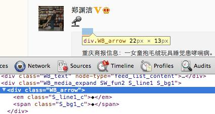

# 纯CSS气泡效果

今天研究了纯CSS实现的气泡效果：

<div style="display:block;width:150px;height:120px;padding:10px;background-color:#fff">
<div style="display:block;position:relative;left:20px;top:10px;width:100px; height:80px; border:1px solid #000;border-radius:5px;background-color:#fff; margin-bottom:20px;"><div style="display:block;position:absolute;left:-21px;top:20px;width:0px;height:0px;border:10px solid;border-color:transparent #000 transparent transparent;"></div><div style="display:block;position:absolute;left:-20px;top:20px;width:0px;height:0px;border:10px solid;border-color:transparent #fff transparent transparent;"></div></div></div>

用小图片实现气泡效果不难，但图片一费流量，二难修改，改边框颜色、大小均要重新生成图片，一个普通的前端设计师和一个优秀的前端设计师的差距就在这里：前者完成任务，后者追求极致。

当然，我作为一个非专业的前端设计师，以上效果也是经若干次Google后总结得出。

**预备知识**：用CSS实现三角形。

实现三角形之前，我们用CSS实现不同颜色的边框：

<div style="display:block;margin:10px;width:30px;height:30px;border-style:solid;border-width:20px;border-color:#f00 #00f #0f0 #f0f;background-color:#fff"></div>

代码：

```html
<div style="display:block;margin:10px;width:30px;height:30px;border-style:solid;border-width:20px;border-color:#f00 #00f #0f0 #f0f;background-color:#fff"></div>
```

把div的`border`加粗，四边颜色不同，就出现了神奇的效果，每一边都变成了梯形。

如果把div的`width`和`height`都设为0，会出现什么情况？

<div style="display:block;margin:10px;width:0;height:0;border-style:solid;border-width:20px;border-color:#f00 #00f #0f0 #f0f;background-color:#fff"></div>

代码：

```html
<div style="display:block;margin:10px;width:0;height:0;border-style:solid;border-width:20px;border-color:#f00 #00f #0f0 #f0f;background-color:#fff"></div>
```

三角形出现了！

但是是4个三角形，而气泡只需要一个！怎么办？把不需要的边框设置为透明：

<div style="display:block;margin:10px;width:0;height:0;border-style:solid;border-width:20px;border-color:transparent #00f transparent transparent;"></div>

代码：

```html
<div style="display:block;margin:10px;width:0;height:0;border-style:solid;border-width:20px;border-color:transparent #00f transparent transparent;"></div>
```

三角形初步完成！

但是气泡的尖角不是三角形，而是斜线，怎么办？也有办法，找两个三角形叠在一起，线条就出来了：

<div style="position:relative;display:block;width:50px;height:50px;"><div style="display:block;position:absolute;left:10px;top:10px;width:0;height:0;border-style:solid;border-width:20px;border-color:transparent #00f transparent transparent;"></div><div style="display:block;position:absolute;left:16px;top:10px;;width:0;height:0;border-style:solid;border-width:20px;border-color:transparent #fff transparent transparent;"></div></div>

代码：

```html
<div style="position:relative;display:block;width:50px;height:50px;">
    <div style="display:block;position:absolute;left:10px;top:10px;width:0;height:0;border-style:solid;border-width:20px;border-color:transparent #00f transparent transparent;"></div>
    <div style="display:block;position:absolute;left:16px;top:10px;;width:0;height:0;border-style:solid;border-width:20px;border-color:transparent #fff transparent transparent;"></div>
</div>
```

为了让大家看清楚，两个三角形距离为6px，如果把距离设为1px，那就是两条细线了。

但是第二个三角是白色的，怎么办？没关系，我们假定气泡的背景色是白色，第二个三角的颜色就正好融入背景色，如果气泡的背景色是其他颜色，就把第二个三角设定成一样的背景色。

同样的道理，第一个三角的颜色要和气泡的边框色一致，通过相对定位，一个完美的气泡就出现了！

最后一步，把样式整理到CSS文件中，写成简洁的形式：

```html
<div class="box">
<div class="triangle-1"></div>
<div class="triangle-2"></div>
<div class="box-content">提示内容...</div>
</div>
```

大功告成！

如果气泡的方向不是向左怎么办？只要叠加出正确方向的三角就行。

最后看看新浪微博的转发气泡是如何实现的：



哈哈，用了特殊字符“◆”，很明显没有我们的实现好，因为字符样式是固定的，而我们的三角可以调尖角！至于怎么调，把上下左右的`border-width`设置成不一样的宽度看看就知道了。
