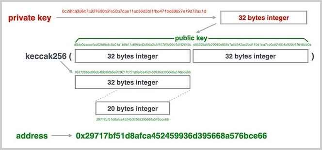

# 账户

以太坊账户负责存储用户的以太坊余额。对大多数普通用户来说，以太坊账户和银行账户非常类似，通常只需要一个账户即可。

确切地说，以太坊账户分为外部账户和合约账户两类：

- 外部账户：即普通用户用私钥控制的账户；
- 合约账户：一种拥有合约代码的账户，它不属于任何人，也没有私钥与之对应。

本节我们仅讨论普通用户使用的外部账户。

和比特币类似，一个以太坊账户就是一个公钥哈希后得到的地址，它是由一个私钥推导出对应的公钥，然后再计算出地址。其中，私钥与公钥算法与比特币完全相同，均为secp256k1椭圆曲线，但和比特币不同的是，以太坊采用非压缩公钥，然后直接对公钥做keccak256哈希，得到32字节的哈希值，取后20字节加上`0x`前缀即为地址：



用代码实现如下：

```x-javascript
const
    randomBytes = require('randombytes'),
    ethUtil = require('ethereumjs-util');

// 生成256bit的随机数作为私钥:
let priKey = randomBytes(32).toString('hex');
// 计算公钥(非压缩格式):
let pubKey = ethUtil.privateToPublic(new Buffer(priKey, 'hex')).toString('hex');
// 计算地址:
let addr = ethUtil.pubToAddress(new Buffer(pubKey, 'hex')).toString('hex');

console.log('Private key: 0x' + priKey);
console.log('Public key: 0x' + pubKey);
console.log('Address: 0x' + addr);
```

和比特币采用Base58或Bech32编码不同，以太坊对私钥和地址均采用十六进制编码，因此它没有任何校验，如果某一位写错了，仍然是一个有效的私钥或地址。

keccak256哈希算法在以太坊中也被称为SHA3算法，但是要注意，keccak算法原本是SHA3的候选算法，然而在SHA3最后的标准化时，对keccak做了改进，因此，标准的SHA3算法和keccak是不同的，只是以太坊在开发时就选择了尚未成为SHA3标准的keccak算法。后续我们在讨论以太坊的哈希算法时，一律使用keccak256而不是SHA3-256。

### 带校验的地址

因为以太坊的地址就是原始哈希的后20字节，并且以十六进制表示，这种方法简单粗暴，但没有校验。地址中任何数字出错都仍是一个有效地址。为了防止抄错，以太坊通过[EIP-55](https://eips.ethereum.org/EIPS/eip-55)实现了一个带校验的地址格式，它的实现非常简单，即对地址做一个keccak256哈希，然后按位对齐，将哈希值≥8的字母变成大写：

<pre><code>original addr = 0x29717bf51d8afca452459936d395668a576bce66
  keccak hash =   e72ec<span style="color:red">ce</span>2e<span style="color:red">b</span>2<span style="color:red">ed</span>0<span style="color:red">f</span>fab5e05f043ee68f<span style="color:red">a</span>b3d<span style="color:red">f</span>759d...
checksum addr = 0x29717<span style="color:red">BF</span>51<span style="color:red">D</span>8<span style="color:red">AF</span>c<span style="color:red">A</span>452459936d395668<span style="color:red">A</span>576<span style="color:red">B</span>ce66
</code></pre>

因此，以太坊地址就是依靠部分变成大写的字母进行校验，它的好处是带校验的地址和不带校验的地址对钱包软件都是一样的格式，缺点是有很小的概率无法校验全部小写的地址。

```x-javascript
const ethUtil = require('ethereumjs-util');

console.log('is valid address: ' + ethUtil.isValidAddress('0x29717bf51d8afca452459936d395668a576bce66')); // true
console.log('is valid checksum address: ' + ethUtil.isValidChecksumAddress('0x29717BF51D8AFcA452459936d395668A576Bce66')); // true
console.log('is valid checksum address: ' + ethUtil.isValidChecksumAddress('0x29717BF51D8AFcA452459936d395668A576BcE66')); // false
```

下面这个程序可以自动搜索指定前缀地址的私钥：

```x-javascript
const randomBytes = require('randombytes');
const ethUtil = require('ethereumjs-util');

// 搜索指定前缀为'0xAA...'的地址:
let prefix = '0xAA';

if (/^0x[a-fA-F0-9]{1,2}$/.test(prefix)) {
    let
        max = parseInt(Math.pow(32, prefix.length-2)),
        qPrefix = prefix.toLowerCase().substring(2),
        prettyPriKey = null,
        prettyAddress = null,
        priKey, pubKey, addr, cAddr, i;

    for (i=0; i<max; i++) {
        priKey = randomBytes(32).toString('hex');
        pubKey = ethUtil.privateToPublic(new Buffer(priKey, 'hex')).toString('hex');
        addr = ethUtil.pubToAddress(new Buffer(pubKey, 'hex')).toString('hex');
        if (addr.startsWith(qPrefix)) {
            cAddr = ethUtil.toChecksumAddress('0x' + addr);
            if(cAddr.startsWith(prefix)) {
                prettyPriKey = priKey;
                prettyAddress = cAddr;
                break;
            }
        }
    }

    if (prettyPriKey === null) {
        console.error('Not found.');
    } else {
        console.log('Private key: 0x' + prettyPriKey);
        console.log('Address: ' + prettyAddress);
    }
} else {
    console.error('Invalid prefix.');
}
```

原理是不断生成私钥和对应的地址，直到生成的地址前缀满足指定字符串。一个可能的输出如下：

```plain
Private key: 0x556ba88aea1249a1035bdd3ec2d97f8c60404e26ecfcd7757e0906885d40322e
Address: 0xAA6f2ea881B96F87152e029f69Bd443834D99f97
```

```alert type=caution title=警告
如果你想用这种方式生成地址，请确保电脑无恶意软件，并在断网环境下用Node执行而不是在浏览器中执行。
```

### HD钱包

因为以太坊和比特币的非对称加密算法是完全相同的，不同的仅仅是公钥和地址的表示格式，因此，比特币的HD钱包体系也完全适用于以太坊。用户通过一套助记词，既可以管理比特币钱包，也可以管理以太坊钱包。

以太坊钱包的派生路径是`m/44'/60'/0'/0/0`，用代码实现如下：

```x-javascript
const
    bitcoin = require('bitcoinjs-lib'),
    bip39 = require('bip39'),
    ethUtil = require('ethereumjs-util');

// 助记词和口令:
let
    words = 'bleak version runway tell hour unfold donkey defy digital abuse glide please omit much cement sea sweet tenant demise taste emerge inject cause link',
    password = 'bitcoin';

// 计算seed:
let seedHex = bip39.mnemonicToSeedHex(words, password);
console.log('seed: ' + seedHex); // b59a8078...c9ebfaaa

// 生成root:
let root = bitcoin.HDNode.fromSeedHex(seedHex);
console.log('xprv: ' + root.toBase58()); // xprv9s21ZrQH...uLgyr9kF
console.log('xpub: ' + root.neutered().toBase58()); // xpub661MyMwA...oy32fcRG

// 生成派生key:
let child0 = root.derivePath("m/44'/60'/0'/0/0");
let prvKey = child0.keyPair.d.toString(16);
let pubKey = ethUtil.privateToPublic(new Buffer(prvKey, 'hex')).toString('hex');
let address = '0x' + ethUtil.pubToAddress(new Buffer(pubKey, 'hex')).toString('hex');
let checksumAddr = ethUtil.toChecksumAddress(address);

console.log("       prv m/44'/60'/0'/0/0: 0x" + prvKey); // 0x6c03e50ae20af44b9608109fc978bdc8f081e7b0aa3b9d0295297eb20d72c1c2
console.log("       pub m/44'/60'/0'/0/0: 0x" + pubKey); // 0xff10c2376a9ff0974b28d97bc70daa42cf85826ba83e985c91269e8c975f75f7d56b9f5071911fb106e48b2dbb2b30e0558faa2fc687a813113632c87c3b051c
console.log("      addr m/44'/60'/0'/0/0: " + address); // 0x9759be9e1f8994432820739d7217d889918f2f07
console.log("check-addr m/44'/60'/0'/0/0: " + checksumAddr); // 0x9759bE9e1f8994432820739D7217D889918f2f07
```

因为以太坊采用账户余额模型，通常情况下一个以太坊地址已够用。如果要生成多个地址，可继续派生`m/44'/60'/0'/0/1`、`m/44'/60'/0'/0/2`等。

### 小结

以太坊的私钥和公钥采用和比特币一样的ECDSA算法和secp256k1曲线，并且可以复用比特币的HD钱包助记词；

以太坊的地址采用对非压缩公钥的keccak256哈希后20字节，并使用十六进制编码，可以通过大小写字母实现地址的校验。
