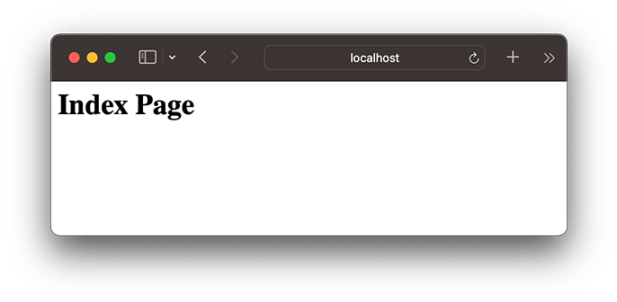

# 处理URL

在hello-koa工程中，我们处理http请求一律返回相同的HTML，这样虽然非常简单，但是用浏览器一测，随便输入任何URL都会返回相同的网页。


正常情况下，我们应该对不同的URL调用不同的处理函数，这样才能返回不同的结果。例如像这样写：

```javascript
app.use(async (ctx, next) => {
    if (ctx.request.path === '/') {
        ctx.response.body = 'index page';
    } else {
        await next();
    }
});

app.use(async (ctx, next) => {
    if (ctx.request.path === '/test') {
        ctx.response.body = 'TEST page';
    } else {
        await next();
    }
});

app.use(async (ctx, next) => {
    if (ctx.request.path === '/error') {
        ctx.response.body = 'ERROR page';
    } else {
        await next();
    }
});
```

这么写是可以运行的，但是好像有点蠢。

应该有一个能集中处理URL的middleware，它根据不同的URL调用不同的处理函数，这样，我们才能专心为每个URL编写处理函数。

### @koa/router

为了处理URL，我们需要引入`@koa/router`这个middleware，让它负责处理URL映射。

我们把上一节的`hello-koa`工程复制一份，重命名为`url-koa`。

先用命令`npm install @koa/router`安装并在`package.json`中添加依赖项，接下来，我们修改`app.mjs`，使用`@koa/router`来处理URL：

```javascript
import Koa from 'koa';
import Router from '@koa/router';

const app = new Koa();
const router = new Router();

// log url:
app.use(async (ctx, next) => {
    console.log(`Process ${ctx.request.method} ${ctx.request.url}...`);
    await next();
});

// 解析request.body:
app.use(bodyParser());

// 设置路由: 处理 /
router.get('/', async (ctx, next) => {
    ctx.response.type = 'text/html';
    ctx.response.body = '<h1>Index Page</h1>';
});

// 设置路由: 处理 /hello/:name
router.get('/hello/:name', async (ctx, next) => {
    // 获取:name参数:
    let s = ctx.params.name;
    ctx.response.type = 'text/html';
    ctx.response.body = `<h1>Hello, ${s}</h1>`;
});

// 使用router:
app.use(router.routes());

app.listen(3000);
console.log('app started at port 3000...');
```

我们使用`router.get('/path', async fn)`来注册一个GET请求。可以在请求路径中使用带变量的`/hello/:name`，变量可以通过`ctx.params.name`访问。

再运行`app.mjs`，我们就可以测试不同的URL：

输入首页：http://localhost:3000/



输入：http://localhost:3000/hello/Bob


### 处理post请求

用`router.get('/path', async fn)`处理的是get请求。如果要处理post请求，可以用`router.post('/path', async fn)`。

用post请求处理URL时，我们会遇到一个问题：post请求通常会发送一个表单，或者JSON，它作为request的body发送，但无论是Node.js提供的原始request对象，还是koa提供的request对象，都*不提供*解析request的body的功能！

所以，我们又需要引入另一个middleware来解析原始request请求，然后，把解析后的参数，绑定到`ctx.request.body`中。`@koa/bodyparser`就是用来干这个活的。

我们用命令`npm install @koa/bodyparser`安装并在`package.json`中添加依赖项，然后，修改`app.mjs`，引入`@koa/bodyparser`：

```javascript
import { bodyParser } from '@koa/bodyparser';
```

在合适的位置加上：

```javascript
app.use(bodyParser());
```

由于middleware的顺序很重要，这个`@koa/bodyparser`必须在`router`之前被注册到`app`对象上。

现在我们就可以处理post请求了。写一个简单的登录表单：

```javascript
router.get('/', async (ctx, next) => {
    ctx.response.type = 'text/html';
    ctx.response.body = `
<h1>Index Page</h1>
<form action="/signin" method="post">
    <p>Name: <input name="name" value="koa"></p>
    <p>Password: <input name="password" type="password"></p>
    <p><button type="submit">Submit</button></p>
</form>
`;
});

router.post('/signin', async (ctx, next) => {
    let name = ctx.request.body.name || '';
    let password = ctx.request.body.password || '';
    console.log(`try signin: ${name}, password: ${password}`);
    if (name === 'koa' && password === '12345') {
        ctx.response.type = 'text/html';
        ctx.response.body = `<h1>Welcome, ${name}!</h1>`;
    } else {
        ctx.response.type = 'text/html';
        ctx.response.body = '<h1>Signin failed!</h1><p><a href="/">Retry</a></p>';
    }
});
```

注意到我们用`let name = ctx.request.body.name || ''`拿到表单的`name`字段，如果该字段不存在，默认值设置为`''`。

类似的，put、delete、head请求也可以由router处理。

### 重构

现在，我们已经可以处理不同的URL了，但是看看`app.mjs`，总觉得还是有点不对劲。


所有的URL处理函数都放到`app.mjs`里显得很乱，而且，每加一个URL，就需要修改`app.mjs`。随着URL越来越多，`app.mjs`就会越来越长。

如果能把URL处理函数集中到某个js文件，或者某几个js文件中就好了，然后让`app.mjs`自动导入所有处理URL的函数。这样，代码一分离，逻辑就显得清楚了。最好是这样：

```ascii
url2-koa/
├── controller/
│   ├── hello.mjs   <-- 处理/hello/:name
│   └── signin.mjs  <-- 处理/signin
├── app.mjs
├── package-lock.json
└── package.json
```

于是我们把`url-koa`复制一份，重命名为`url2-koa`，准备重构这个项目。

我们先在`controller`目录下编写`signin.mjs`：

```javascript
// GET /
async function index(ctx, next) {
    ctx.response.type = 'text/html';
    ctx.response.body = `
<h1>Index Page</h1>
<form action="/signin" method="post">
    <p>Name: <input name="name" value="koa"></p>
    <p>Password: <input name="password" type="password"></p>
    <p><button type="submit">Submit</button></p>
</form>
`;
}

// POST /signin
async function signin(ctx, next) {
    let name = ctx.request.body.name || '';
    let password = ctx.request.body.password || '';
    console.log(`try signin: ${name}, password: ${password}`);
    if (name === 'koa' && password === '12345') {
        ctx.response.type = 'text/html';
        ctx.response.body = `<h1>Welcome, ${name}!</h1>`;
    } else {
        ctx.response.type = 'text/html';
        ctx.response.body = '<h1>Signin failed!</h1><p><a href="/">Retry</a></p>';
    }
}

// 导出处理函数:
export default {
    'GET /': index,
    'POST /signin': signin
};
```

这个`signin.mjs`通过`export default`把两个URL处理函数暴露出来。

类似的，`hello.mjs`把一个URL处理函数暴露出来：

```javascript
async function hello(ctx, next) {
    // 获取:name参数:
    let s = ctx.params.name;
    ctx.response.type = 'text/html';
    ctx.response.body = `<h1>Hello, ${s}</h1>`;
}

export default {
    'GET /hello/:name': hello
}
```

现在，我们修改`app.mjs`，让它自动扫描`controller`目录，找到所有`js`文件，导入，然后注册每个URL：

```javascript
// 扫描controller目录:
const dirname = path.dirname(fileURLToPath(import.meta.url));
console.log(`scan dir ${dirname}...`);
// 列举 *.mjs 文件:
let files = readdirSync(path.join(dirname, 'controller')).filter(f => f.endsWith('.mjs'));
for (let file of files) {
    // 导入模块:
    console.log(`import controller/${file}...`);
    let { default: mapping } = await import(`./controller/${file}`);
    // 把每个URL映射添加到router:
    for (let url in mapping) {
        if (url.startsWith('GET ')) {
            // 类似 'GET /hello/:name'
            let p = url.substring(4);
            router.get(p, mapping[url]);
            console.log(`mapping: GET ${p}`);
        } else if (url.startsWith('POST ')) {
            // 类似 'POST /signin'
            let p = url.substring(5);
            router.post(p, mapping[url]);
            console.log(`mapping: POST ${p}`);
        } else {
            console.warn(`invalid mapping: ${url}`);
        }
    }
}
```

### Controller Middleware

最后，我们把扫描`controller`目录和创建`router`的代码从`app.mjs`中提取出来，作为一个简单的middleware使用，命名为`controller.mjs`：

```javascript
// controller.mjs:
async function scan(router, controllerDir) {
    // 扫描controller目录:
    const dirname = path.dirname(fileURLToPath(import.meta.url));
    console.log(`scan dir ${dirname}...`);
    let files = readdirSync(path.join(dirname, controllerDir)).filter(f => f.endsWith('.mjs'));
    for (let file of files) {
        // 导入模块:
        console.log(`import controller/${file}...`);
        let { default: mapping } = await import(`./${controllerDir}/${file}`);
        // 把每个URL映射添加到router:
        for (let url in mapping) {
            if (url.startsWith('GET ')) {
                let p = url.substring(4);
                router.get(p, mapping[url]);
                console.log(`mapping: GET ${p}`);
            } else if (url.startsWith('POST ')) {
                let p = url.substring(5);
                router.post(p, mapping[url]);
                console.log(`mapping: POST ${p}`);
            } else {
                console.warn(`invalid mapping: ${url}`);
            }
        }
    }
}

// 默认扫描目录为 controller:
export default async function (controllerDir = 'controller') {
    const router = new Router();
    await scan(router, controllerDir);
    return router.routes();
}
```

这样一来，我们在`app.mjs`的代码又简化了：

```javascript
import controller from './controller.mjs';
...
// 使用controller(), 注意controller模块导出的是async函数，要通过await调用:
app.use(await controller());
...
```

经过重新整理后的工程`url2-koa`目前具备非常好的模块化，所有处理URL的函数按功能组存放在`controller`目录，今后我们也只需要不断往这个目录下加东西就可以了，`app.mjs`保持不变。

### 参考源码

[url-koa](https://github.com/michaelliao/learn-javascript/tree/master/samples/node/web/koa/url-koa)

[url2-koa](https://github.com/michaelliao/learn-javascript/tree/master/samples/node/web/koa/url2-koa)


```ascii
           │
           │
           ▼
┌─────────────────────┐
│log:                 │
│async(ctx,next) {...}│
└─────────────────────┘
           │
           ▼
┌─────────────────────┐
│bodyParser()         │
└─────────────────────┘     GET /             ┌─────────────────────┐
           │              ┌──────────────────▶│async(ctx,next) {...}│
           ▼              │                   └─────────────────────┘
┌─────────────────────┐   │ POST /signin      ┌─────────────────────┐
│router.routes()      ├───┼──────────────────▶│async(ctx,next) {...}│
└─────────────────────┘   │                   └─────────────────────┘
                          │ GET /hello/:name  ┌─────────────────────┐
                          └──────────────────▶│async(ctx,next) {...}│
                                              └─────────────────────┘
```

