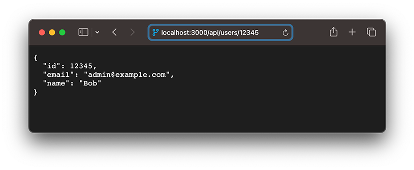
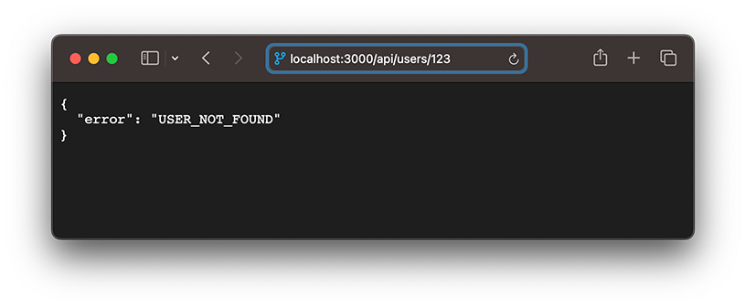

# 使用REST

自从Roy Fielding博士在2000年他的博士论文中提出[REST](https://zh.wikipedia.org/wiki/REST)（Representational State Transfer）风格的软件架构模式后，REST就基本上迅速取代了复杂而笨重的SOAP，成为Web API的标准了。

什么是Web API呢？

如果我们想要获取某个电商网站的某个商品，输入`http://localhost:3000/products/123`，就可以看到id为123的商品页面，但这个结果是HTML页面，它同时混合包含了Product的数据和Product的展示两个部分。对于用户来说，阅读起来没有问题，但是，如果机器读取，就很难从HTML中解析出Product的数据。

如果一个URL返回的不是HTML，而是机器能直接解析的数据，这个URL就可以看成是一个Web API。比如，读取`http://localhost:3000/api/products/123`，如果能直接返回Product的数据，那么机器就可以直接读取。

REST就是一种设计API的模式。最常用的数据格式是JSON。由于JSON能直接被JavaScript读取，所以，以JSON格式编写的REST风格的API具有简单、易读、易用的特点。

编写API有什么好处呢？由于API就是把Web App的功能全部封装了，所以，通过API操作数据，可以极大地把前端和后端的代码隔离，使得后端代码易于测试，前端代码编写更简单。

此外，如果我们把前端页面看作是一种用于展示的客户端，那么API就是为客户端提供数据、操作数据的接口。这种设计可以获得极高的扩展性。例如，当用户需要在手机上购买商品时，只需要开发针对iOS和Android的两个客户端，通过客户端访问API，就可以完成通过浏览器页面提供的功能，而后端代码基本无需改动。

当一个Web应用以API的形式对外提供功能时，整个应用的结构就扩展为：


把网页视为一种客户端，是REST架构可扩展的一个关键。

### REST API规范

编写REST API，实际上就是编写处理HTTP请求的async函数，不过，REST请求和普通的HTTP请求有几个特殊的地方：

1. REST请求仍然是标准的HTTP请求，但是，除了GET请求外，POST、PUT等请求的body是JSON数据格式，请求的`Content-Type`为`application/json`；
2. REST响应返回的结果是JSON数据格式，因此，响应的`Content-Type`也是`application/json`。

REST规范定义了资源的通用访问格式，虽然它不是一个强制要求，但遵守该规范可以让人易于理解。

例如，商品Product就是一种资源。获取所有Product的URL如下：

```
GET /api/products
```

而获取某个指定的Product，例如，id为`123`的Product，其URL如下：

```
GET /api/products/123
```

新建一个Product使用POST请求，JSON数据包含在body中，URL如下：

```
POST /api/products
```

更新一个Product使用PUT请求，例如，更新id为`123`的Product，其URL如下：

```
PUT /api/products/123
```

删除一个Product使用DELETE请求，例如，删除id为`123`的Product，其URL如下：

```
DELETE /api/products/123
```

资源还可以按层次组织。例如，获取某个Product的所有评论，使用：

```
GET /api/products/123/reviews
```

当我们只需要获取部分数据时，可通过参数限制返回的结果集，例如，返回第2页评论，每页10项，按时间排序：

```
GET /api/products/123/reviews?page=2&size=10&sort=time
```

### koa处理REST

既然我们已经使用koa作为Web框架处理HTTP请求，因此，我们仍然可以在koa中响应并处理REST请求。

我们复制上一节的工程，重命名为`koa-rest`，然后准备添加REST API。

对于controller来说，我们只要返回如下内容即可视为一个REST API：

```javascript
ctx.body =  {
    id: 12345,
    name: 'Bob',
    description: 'A rest api'
};
```

koa检测到`ctx.body`的赋值是一个JavaScript对象时，自动把这个Object变成JSON字符串输出，无需任何额外配置和代码。

```alert type=info title=提示
ctx.body是ctx.response.body的引用，两者效果是一样的。
```

我们给`signin.mjs`添加两个REST API：

- `GET /api/users/:id`：根据id获取用户信息；
- `POST /api/signin`：发送一个POST请求，并返回登录结果。

获取用户信息的async函数如下：

```javascript
// /api/users/:id
async function user_info(ctx, next) {
    let id = ctx.params.id;
    if (id === '12345') {
        ctx.body = {
            id: 12345,
            email: 'admin@example.com',
            name: 'Bob'
        };
    } else {
        ctx.body = {
            error: 'USER_NOT_FOUND'
        };
    }
}
```

处理登录请求的async函数如下：

```javascript
async function signin(ctx, next) {
    let email = ctx.request.body.email || '';
    let password = ctx.request.body.password || '';
    if (email === 'admin@example.com' && password === '123456') {
        console.log('signin ok!');
        ctx.body = {
            id: 12345,
            email: email,
            name: 'Bob'
        };
    } else {
        console.log('signin failed!');
        ctx.body = {
            error: 'SIGNIN_FAILED'
        };
    }
}
```

当发生错误时，返回的信息包含`error`字段，客户端依靠该字段来判断是否出错。

最后导出URL处理函数：

```javascript
export default {
    'POST /api/signin': signin,
    'GET /api/users/:id': user_info
};
```

现在，我们可以直接在浏览器测试GET请求：



输入无效的ID，返回错误：



对于POST请求，我们无法直接在浏览器测试，可以用`curl`命令测试如下：

```plain
$ curl -H 'Content-Type: application/json' \
-d '{"email":"admin@example.com","password":"123456"}' \
http://localhost:3000/api/signin
{
  "id": 12345,
  "email": "admin@example.com",
  "name": "Bob"
}
```

输入错误的口令，返回错误信息：

```plain
$ curl -H 'Content-Type: application/json' \
-d '{"email":"admin@example.com","password":"invalid"}' \
http://localhost:3000/api/signin
{
  "error": "SIGNIN_FAILED"
}
```

由于我们把登录从传统的POST表单改成了REST，因此，前端页面需要编写JavaScript代码来发送REST请求，修改HTML如下：

```html
<!-- 给form加上onsubmit回调函数 -->
<form id="signin-form" onsubmit="return signin()">
    ...
</form>
```

用JavaScript发送REST请求如下：

```javascript
function signin() {
    // 获取表单输入:
    let form = document.querySelector('#signin-form');
    let email = form.querySelector('input[name=email]').value;
    let password = form.querySelector('input[name=password]').value;
    // REST请求的数据:
    let data = {
        email: email,
        password: password
    };
    // 发送请求:
    fetch('/api/signin', {
        // 以POST方式发送:
        method: 'POST',
        headers: {
            // Content-Type设置为JSON:
            'Content-Type': 'application/json'
        },
        // 发送数据序列化为JSON:
        body: JSON.stringify(data)
    }).then(resp => {
        // 收到响应后解析JSON数据:
        resp.json().then(result => {
            // 解析后的数据:
            console.log(result);
            // 判断是否有error字段:
            if (result.error) {
                alert(`Sign in failed: ${result.error}`);
            } else {
                // 登录成功,取出name字段:
                alert(`Welcome, ${result.name}!`);
            }
        });
    });
    // 必须返回false以取消浏览器自动提交表单:
    return false;
}
```

可见，在koa中处理REST请求是非常简单的。`bodyParser()`这个middleware可以解析请求的JSON数据并绑定到`ctx.request.body`上，输出JSON时我们把JavaScript对象赋值给`ctx.response.body`就完成了REST请求的处理。

### 参考源码

[koa-rest](koa-rest.zip)
